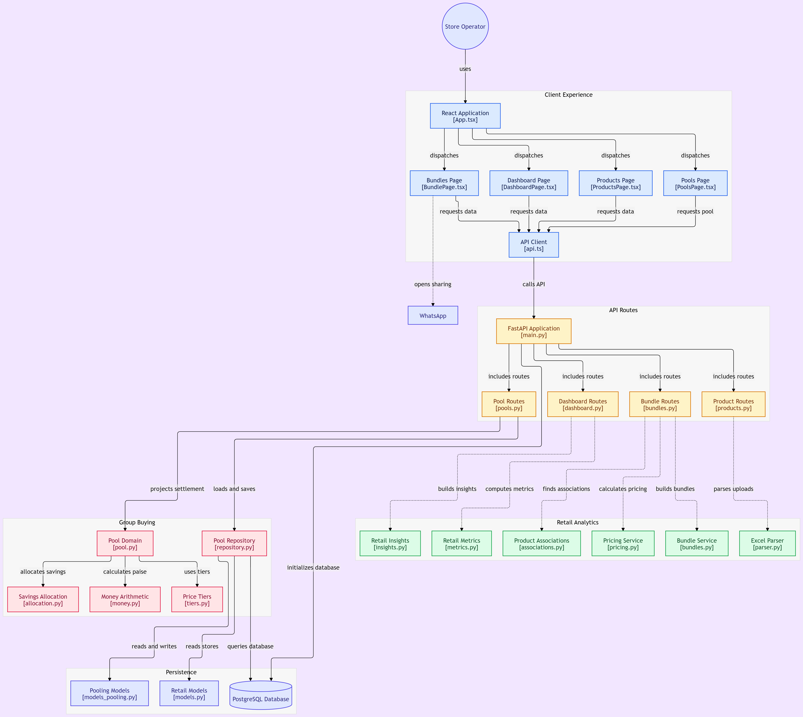

# StepToSale

[](https://codecov.io/github/ayushman-hss/StepToSale)

**Retail analytics for small neighbourhood shops.**

StepToSale is a retail intelligence platform built around a simple question:

> **Are you above the line?**

For a small shop, that question can mean very different things:

- Are enough of the people entering the shop actually buying?
- Which products are naturally bought together?
- Can nearby shops combine demand to unlock better wholesale prices?

StepToSale turns ordinary retail data into actionable answers across all three.

Built with **FastAPI + PostgreSQL** on the backend and **React + TypeScript + Vite** on the frontend.

---

## What StepToSale does

StepToSale currently contains three retail analytics tools.

### 1. Sales vs Footfall

**"People are coming in. Are they actually buying?"**

The dashboard combines hourly visitor counts with actual transactions and sales to calculate:

- Conversion rate
- Average basket value
- Hourly sales patterns
- Footfall patterns
- Day-of-week behaviour
- Concentration of visitors into peak hours

Instead of only showing charts, the system turns the numbers into simple observations such as:

> **18:00 is your busiest hour, but conversion is 12% vs 21% average.**

or:

> **62% of your footfall happens in 3 hours.**

These observations can be forwarded as a WhatsApp-ready message.

The important distinction is that **footfall and sales are treated as different signals**.

A POS system knows who bought something.

It does not know how many people walked past the counter, entered the shop and left without buying.

StepToSale therefore models footfall separately and uses it to expose opportunities that sales data alone cannot show.

---

### 2. Bundles

**"What are my customers already buying together?"**

StepToSale analyses transaction line items using **market-basket analysis**.

It looks for product pairs that occur together more frequently than would be expected by chance.

For each suggested bundle, the system shows:

- How frequently the products appear together
- Association strength
- Lift over random co-occurrence
- A suggested bundle price
- The resulting margin

The pricing engine also respects a configurable **minimum margin floor**.

So the system does not simply say:

> "These two products sell together."

It can instead answer:

> "These products are already commonly purchased together. Here is a bundle price that preserves your required margin."

The merchant remains in control:

**Approve → Edit → Reject**

Nothing is automatically applied.

---

### 3. Group Buying

**"Can neighbouring shops combine demand to get a better wholesale price?"**

Small retailers often cannot reach supplier volume tiers individually.

For example:

| Quantity | Supplier price |
|---:|---:|
| 1–19 kg | ₹45/kg |
| 20–49 kg | ₹40/kg |
| 50+ kg | ₹35/kg |

Suppose:

- Shop S1 needs 15 kg
- Shop S2 needs 20 kg

Individually:

- S1 pays ₹45/kg
- S2 pays ₹40/kg

Together they need **35 kg**, crossing the ₹40/kg tier.

The technical problem then becomes:

> **How should the resulting saving be divided?**

StepToSale calculates multiple allocation methods, including:

- Flat unit price
- Pro-rata allocation
- Shapley allocation

The important part is not simply reaching a cheaper supplier tier.

It is producing a settlement where:

- every shop's payable amount is explicit,
- the allocation rule is deterministic,
- the totals reconcile exactly,
- and the supplier invoice is fully accounted for.

Every state transition is also recorded in an append-only event log, allowing a pool to be reconstructed instead of relying entirely on mutable state.

---

# Architecture

StepToSale separates the user interface, API layer, retail analytics, group-buying domain logic and persistence.



*Architecture diagram generated from the repository structure using GitDiagram.*

### Request flow

```text
Store Operator
      │
      ▼
React Application
      │
      ▼
Typed API Client
      │
      ▼
FastAPI Routes
      │
      ├─────────────────────┐
      ▼                     ▼
Retail Analytics       Group Buying
      │                     │
      │                     ├── Price Tiers
      │                     ├── Money Arithmetic
      │                     └── Savings Allocation
      │
      ├── Metrics
      ├── Insights
      ├── Associations
      ├── Pricing
      └── Bundles
              │
              ▼
         PostgreSQL
```

### Separation of responsibilities

**Frontend**

React pages handle the user-facing experience and communicate with the backend through a typed API client.

**API layer**

FastAPI routes expose application capabilities without putting the business logic directly inside HTTP handlers.

**Retail analytics**

The analytics layer contains independent services for metrics, insights, market-basket associations, bundle pricing and bundle generation.

**Group-buying domain**

Group buying has a separate domain layer responsible for tier calculations, money arithmetic and savings allocation. This keeps the financial rules independent from the HTTP/API layer.

**Persistence**

PostgreSQL stores the retail and pooling models, while repositories handle persistence for the group-buying domain.

---

# The demo data simulation

A common problem with synthetic dashboards is:

> **Random numbers that happen to look like business data.**

StepToSale instead generates synthetic retail data using explicit behavioural assumptions.

This is **not claimed to be a statistically representative dataset of Indian retail**.

Instead, it is a controlled simulation designed around recognizable neighbourhood-retail behaviours so that the application has realistic-looking, reproducible data with known underlying patterns.

The generator currently models:

- Time of day
- Day of week
- Monthly salary cycle
- Store format
- Product mix
- Price sensitivity
- Basket sizes
- Product affinities
- Day-to-day variation

---

## How the simulation works

### Time of day

Stores have their own operating hours and peak periods.

A residential kirana and a station kiosk therefore do not receive identical traffic patterns.

Peak hours are weighted more heavily rather than being the only hours in which purchases occur.

---

### Day of week

The two simulated stores behave differently across the week.

The residential kirana becomes busier towards the weekend, while the station kiosk is heavily dependent on weekday commuter traffic.

This creates different weekly demand patterns between stores instead of applying one generic distribution everywhere.

---

### Monthly salary cycle

The kirana receives an additional demand boost around the beginning of the month.

The generator also increases quantities of staple products during this period, representing household restocking behaviour.

The station kiosk deliberately does not receive the same salary-cycle effect.

---

### Store format

The stores have different product mixes.

**Residential kirana**

- Foodgrains, oil and masala
- Dairy and bakery products
- Snacks
- Beverages
- Cleaning and household products
- Beauty and hygiene products

**Station kiosk**

- Snacks
- Drinks
- Biscuits
- Quick bakery purchases

The kiosk has very little simulated demand for products such as rice or detergent because its shopping context is based around quick grab-and-go purchases.

---

### Price sensitivity

Products are not sampled with equal probability.

The generator uses a price-weighting model:

```text
purchase weight ∝ price^(-elasticity)
```

Different categories have different elasticity values.

Everyday necessities therefore experience a weaker price effect, while discretionary products are more sensitive to price.

This prevents an expensive product from unrealistically outselling low-cost everyday goods simply because both were assigned the same random probability.

The station kiosk also has a higher price-sensitivity factor because its purchases are modelled as smaller, more discretionary impulse purchases.

---

### Basket sizes

Customers do not always buy one product.

Different store formats use different basket-size distributions.

The kirana therefore produces more multi-item household baskets, while the station kiosk produces a much larger share of single-item purchases.

---

### Product affinities

Multi-item baskets are not simply random combinations.

The generator defines category-level relationships such as:

- Snacks + beverages
- Biscuits + dairy
- Bread + beverages
- Oil + masala
- Household staples + cleaning products
- Personal-care combinations

A subset of these relationships becomes **signature pairings** that occur more frequently than the rest.

The strongest pairing is sampled more frequently than weaker pairings, creating a long-tail distribution of co-purchases instead of making every possible product combination equally likely.

This gives the market-basket engine meaningful associations to discover.

---

## Why this simulation is useful

The generator creates a controlled dataset where several independent signals interact:

```text
Store format
     │
     ├── Product catalogue
     │
     ├── Customer behaviour
     │
     ├── Time-of-day patterns
     │
     ├── Day-of-week patterns
     │
     ├── Monthly salary cycle
     │
     ├── Price sensitivity
     │
     ├── Basket size
     │
     └── Product affinities
             │
             ▼
       Synthetic transactions
             │
       ┌─────┴─────┐
       ▼           ▼
   Sales data   Footfall model
       │           │
       └─────┬─────┘
             ▼
       StepToSale analytics
```

This is particularly useful for a demo because the dataset has **known underlying behaviour**.

For example:

- The generator intentionally creates stronger snack + beverage relationships.
- The kirana and station kiosk have intentionally different demand patterns.
- Monthly demand changes are intentionally introduced for the kirana.
- Product purchase frequencies are influenced by price.
- Basket sizes vary according to store format.

This makes the demo reproducible while still giving the analytics system non-uniform patterns to discover.

---

## What is deliberately not simulated yet

The current generator does **not** attempt to model every factor affecting real retail demand.

In particular:

- Weather
- Festivals and holidays
- Promotions
- Competitor pricing
- Stock-outs
- Local events
- Individual customer demographics

are currently outside the simulation.

Weather and festival effects are intended to be introduced as separate inputs rather than hidden inside the existing randomisation.

---

# Sales and footfall are separate signals

The transaction generator creates the **actual sales history**.

The footfall generator then reads that history and derives:

- Transaction count
- Sales

directly from the sale lines, while modelling **only the missing variable: visitors**.

This prevents an important class of demo inconsistency:

> The dashboard cannot claim that 100 transactions happened while the transaction dataset contains only 80.

Transactions and sales are therefore grounded in the same underlying sales data.

Footfall is then generated around those transactions according to each store's conversion profile.

For example:

```text
Residential kirana
        │
        ▼
Higher purchase intent
        │
        ▼
Higher conversion
        │
        ▼
Moderate footfall
```

while:

```text
Station kiosk
        │
        ▼
Large passing crowd
        │
        ▼
Lower purchase intent
        │
        ▼
High footfall + lower conversion
```

This produces two stores that behave differently for a reason rather than because one happened to receive a larger random number.

---

# Data generation pipeline

The demo dataset is generated in two stages.

### Stage 1 — Transaction generation

```text
Product catalogue
       +
Store profile
       +
Behavioural rules
       ↓
sales_lines_S1.xlsx
sales_lines_S2.xlsx
```

The transaction generator creates approximately twelve weeks of history, ending at the current time.

Each sale line contains:

```text
date
hour
transaction_id
sku
qty
unit_price
```

The current day is truncated at the present moment so the demo does not contain future transactions.

---

### Stage 2 — Footfall generation

The footfall generator reads the transaction history and aggregates it by:

```text
date + hour
```

It then models visitors using each store's conversion profile.

The result is:

```text
sample-data.xlsx
```

containing:

```text
date
hour
footfall
transactions
sales
store_id
```

This means the dashboard's transaction and sales values originate from the same underlying sales lines used by the bundle engine.

---

# Why the numbers are trustworthy

Retail analytics becomes useless if the numbers do not reconcile.

StepToSale therefore treats financial correctness as a first-class concern.

### Integer money

Money is represented in **integer paise** rather than floating-point currency values.

This prevents rounding errors from silently entering settlements.

### Exact allocation

Discounts and savings are allocated using the **largest-remainder method**.

The resulting amounts are asserted to sum exactly to the required total.

If the books do not balance, the settlement fails instead of returning an apparently valid but incorrect result.

### Rotating remainder

When two shops have identical claims, the leftover paisa does not permanently go to the same shop.

The pool cycle affects the tie-breaking position so repeated pools do not systematically favour one participant.

### Versioned supplier prices

Supplier price lists are versioned.

A closed pool records the exact price-list version used during settlement.

Changing a supplier's prices later therefore cannot rewrite the financial history of an already-closed pool.

---

# Tech stack

### Backend

- Python 3.11+
- FastAPI
- SQLModel
- PostgreSQL
- Alembic
- Pytest
- Pandas

### Frontend

- React
- TypeScript
- Vite
- ECharts

### Analytics

- Rule-based retail insights
- Hourly/daily aggregation
- Market-basket association analysis
- Margin-floor pricing
- Tiered supplier pricing
- Pro-rata allocation
- Shapley allocation

The current analytics do **not require machine learning**.

---

# Project structure

```text
StepToSale/
│
├── backend/
│   ├── app/
│   │   ├── main.py              FastAPI application
│   │   ├── models.py            Retail SQLModel tables
│   │   ├── models_pooling.py    Group-buying SQLModel tables
│   │   │
│   │   ├── routers/
│   │   │   ├── dashboard.py     Dashboard API routes
│   │   │   ├── bundles.py       Bundle API routes
│   │   │   ├── products.py      Product API routes
│   │   │   └── pools.py         Group-buying API routes
│   │   │
│   │   └── services/
│   │       ├── metrics.py       Hourly/daily/heatmap aggregates
│   │       ├── insights.py      Rule-based business observations
│   │       ├── associations.py  Market-basket analysis
│   │       ├── pricing.py       Margin-floor bundle pricing
│   │       ├── bundles.py       Bundle generation
│   │       └── pooling/         Group-buying domain logic
│   │
│   ├── alembic/                 Database migrations
│   ├── scripts/
│   │   ├── generate_bundle_sample.py
│   │   ├── generate_sample.py
│   │   └── reset_demo.py
│   │
│   └── tests/                   Backend tests
│
├── frontend/
│   └── src/
│       ├── pages/               Application pages
│       ├── components/          Feature-specific components
│       ├── lib/
│       │   ├── ui/              Design system
│       │   └── charts/          ECharts configuration
│       ├── api.ts               Typed API client
│       └── store.ts             Dashboard filter state
│
├── docs/
│   └── architecture.png        System architecture diagram
│
└── README.md
```

---

# Running locally

## Prerequisites

- Python 3.11+
- Node.js 18+
- PostgreSQL 15+
- Docker (optional)

---

## 1. Start PostgreSQL

Using Docker:

```bash
docker compose up -d db
```

Or create the database manually:

```sql
CREATE USER footfall WITH PASSWORD 'footfall' LOGIN;
CREATE DATABASE footfall OWNER footfall;

\c footfall

GRANT ALL ON SCHEMA public TO footfall;
ALTER SCHEMA public OWNER TO footfall;
```

The schema permissions are important for PostgreSQL 15+ because otherwise Alembic may fail with:

```text
permission denied for schema public
```

---

## 2. Set up the backend

```bash
cd backend

python -m venv .venv
```

### Windows

```powershell
.venv\Scripts\Activate.ps1
```

### macOS / Linux

```bash
source .venv/bin/activate
```

Install dependencies:

```bash
pip install -r requirements.txt
```

Create the environment file:

```bash
cp .env.example .env
```

Update `DATABASE_URL` if necessary.

Run migrations:

```bash
alembic upgrade head
```

---

## 3. Generate the demo data

```bash
python scripts/reset_demo.py
```

The reset process regenerates the coherent demo dataset used by the application.

The transaction generator creates the historical sale lines first, after which the footfall dataset is generated from those sales.

---

## 4. Start the API

```bash
uvicorn app.main:app --reload --port 8000
```

API documentation:

```text
http://localhost:8000/docs
```

---

## 5. Start the frontend

In another terminal:

```bash
cd frontend

npm install
npm run dev
```

Open:

```text
http://localhost:5173
```

---

# Testing

Run the backend test suite with:

```bash
cd backend

pip install -r requirements-dev.txt

python -m pytest tests/ -q
```

The current suite contains **178 tests** covering areas including:

- Supplier tiers
- Pool lifecycle
- Money calculations
- Allocation rules
- Settlement invariants
- Property-based checks

One of the core financial invariants is:

```text
sum(all shop payables) == supplier invoice
```

If that invariant cannot be satisfied, the settlement should fail rather than produce an incorrect result.

---

# Current limitations

StepToSale is deliberately not pretending to be a complete retail ERP or payment platform.

The following areas are currently modelled at the domain layer but are not fully implemented in the UI/infrastructure.

### Payments

The system calculates exactly what each shop owes.

It does not collect the money.

### Supplier portal

Suppliers, price lists and tiered pricing are represented in the database and demo data.

There is currently no supplier-facing management interface.

### Multiple pools

The schema supports multiple pools.

The current interface focuses on one active pool for simplicity.

### Notifications

The event log records events such as:

```text
pool crossed a tier
pool approaching closure
```

but no notification service currently dispatches them.

### Concurrency

Orders are validated before being written, but optimistic locking is not currently implemented.

Two shops committing simultaneously could therefore theoretically price against stale tier information.

### Synthetic data

The demo data is intentionally synthetic.

It is designed to reproduce plausible retail behaviours and provide reproducible test/demo conditions; it should **not** be interpreted as a statistically representative sample of Indian retail.

---

# Roadmap

Potential next steps include:

- Real weather data integration
- Official holiday/festival calendars
- Promotion-aware demand simulation
- Supplier-facing portal
- Multi-pool management
- Notifications
- Optimistic concurrency control
- Real POS integrations
- Real supplier integrations
- More sophisticated demand forecasting
- Historical price changes
- Stock-out modelling

---

# What makes the project interesting

StepToSale is not just a dashboard showing sales charts.

The three features operate at different levels of the same retail problem:

```text
                    RETAIL DECISIONS
                          │
        ┌─────────────────┼─────────────────┐
        │                 │                 │
        ▼                 ▼                 ▼
   CUSTOMER FLOW      CUSTOMER BASKETS   PURCHASING POWER
        │                 │                 │
        ▼                 ▼                 ▼
     Footfall          Bundles         Group Buying
        │                 │                 │
        ▼                 ▼                 ▼
   "Why aren't       "What can I      "Can we buy
    visitors          sell together?"   cheaper?"
    converting?"
```

The project therefore moves from:

**understanding demand → increasing basket value → reducing procurement cost.**

---

# License

MIT